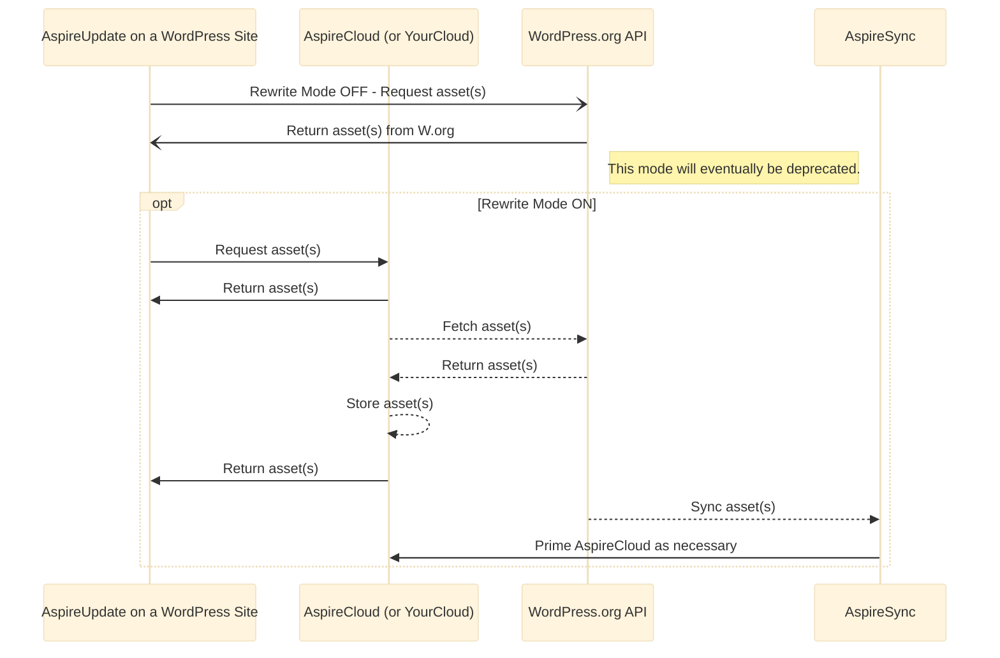

# What is AspireUpdate?

[AspireUpdate](https://github.com/aspirepress/AspireUpdate) is an open source WordPress plugin that enables WordPress sites to use an alternative repository for updates. The plugin reverts to WordPress.org repository when updates are not available in the configured AspireCloud instance.
[AspireUpdate](https://github.com/aspirepress/AspireUpdate) is an open source WordPress plugin that enables WordPress sites to use an alternative repository for updates. The plugin reverts to WordPress.org repository when updates are not available in the configured AspireCloud instance.

## Design of Phase 1 of AspirePress

AspirePress inspiration is the Domain Name System (DNS). AspirePress has architecturally a very similar approach, except instead of domain records and zones, AspirePress serves WordPress assets.

Overall Status: Phase 1 doesn’t implement all of this design yet.

State Diagram:

[Diagram by Mermaid](https://github.blog/developer-skills/github/include-diagrams-markdown-files-mermaid/)

This approach has several benefits:

1. Scopes down AspireSync entirely out of the solution for now. No federation between AspireClouds for now. Initial mirror(s) start with zero plugins or themes and grow organically as demand for hosting on mirror grows. Installation is greatly reduced as you need AspireUpdate plugin at the user's end and AspireCloud service to handle update requests and delegate to .org if there is no asset to serve from configured API update endpoint.

2. Hosting companies can set this up for their default WordPress installs with default AspireClouds on their own. Let a million mirrors bloom!

3. Aspire Updater plugin is installed on a site. User can choose from a list of known AspireClouds, or it can be locked to one by host.

4. The plugin rewrites all API calls to api.aspirepress.org or to another AspireCloud powered API. AP maintains for now a set of trusted API end points which correspond to AspireCloud mirrors.

5. If AspireCloud has a response, that requested asset is available, we give the asset back to plugin.

6. If AspireCloud does not have the asset, AspireUpdate then calls .org canonical repo. It fetches the asset, pushes the whole response to AspireCloud to populate the mirror with the requested asset. This is how a specific AspireCloud gets populated with new assets beyond manual population by a plugin or theme developer.

7. AspireUpdate passes the response of asset back to WordPress for handling the update install process.

8. AspireCloud receives the asset, stores it in the data store. It can later serve requests for newly acquired asset.

9. The asset that was pulled in from .org will expire after say 1 day (configurable).

10. Once the asset expires, future requests to AspireCloud tells AspireUpdate that it doesn’t have the asset, fetches it again in the similar approach as above.

11. The Process repeats as requests are made for updates. Delegations are made to WordPress.org are made when an asset locally is not available.

